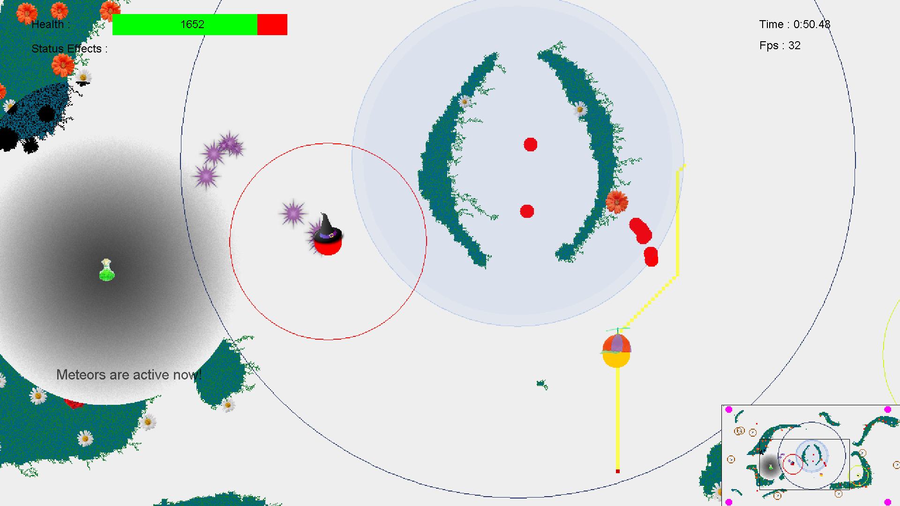
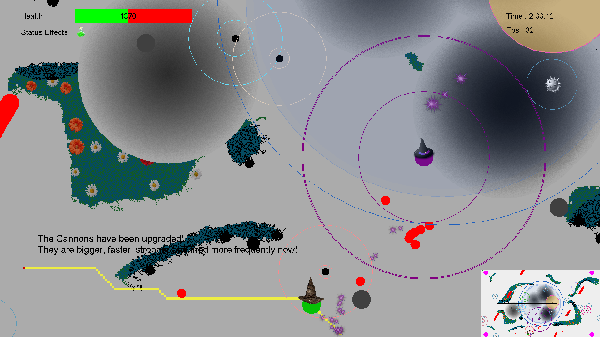
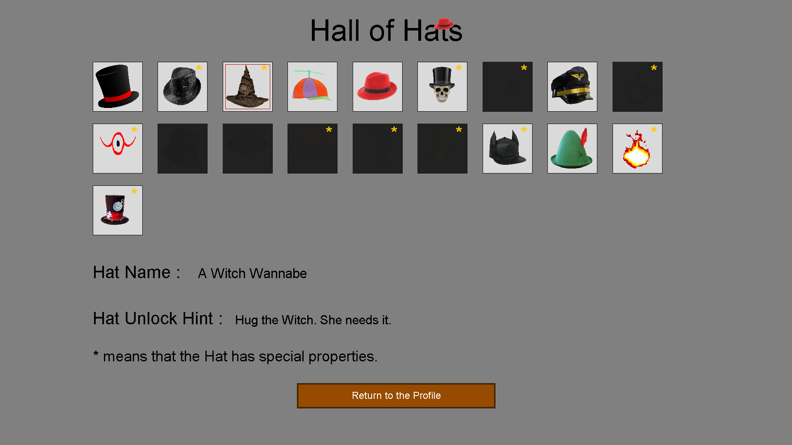

# Hatman - A survival game
An indie game made in java with 2D graphics. The aim is to survive as long as possible.

<b> Try to survive as long as possible while running from hazards that get increasingly more difficult: </b>

 

### Hazards in the game
- Red balls that float around and chase you.
- Cannons that fire every 5 seconds from all four corners.
- The witch that chase and cast fire upon you.
- Meteors that randomly fall down and stun you.
- And many more...

*Hint:* No matter what you need to keep moving!

### Achievements (Hats)
Unlock various hats as you complete secret achievement and fill your hall of hats:

*Hint:* Some of them comes with special effects!
